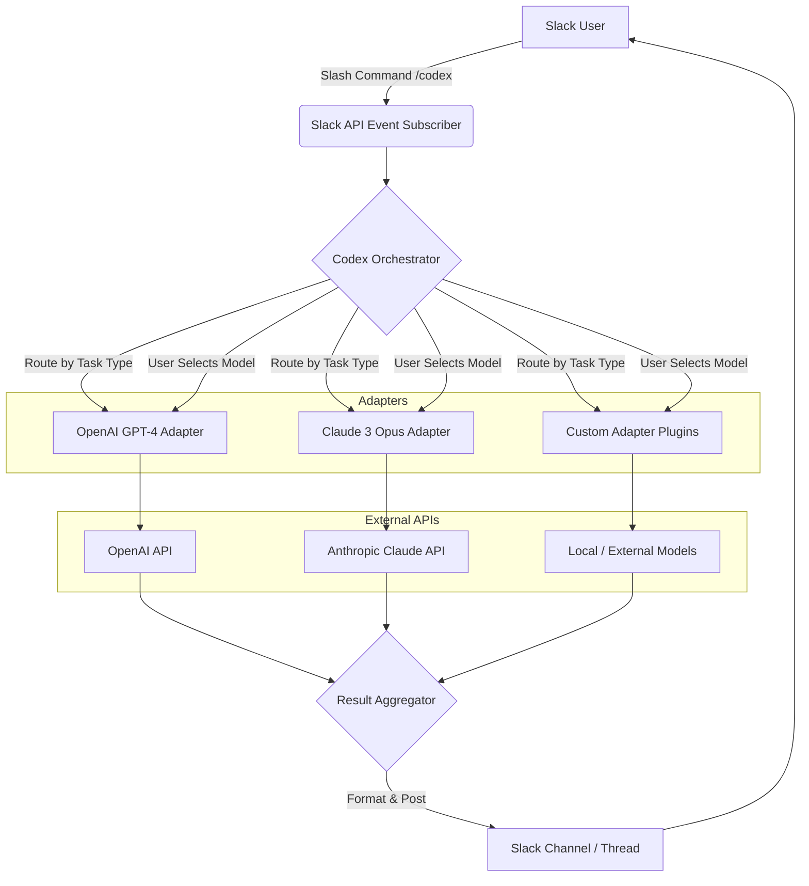

# Codex: The Universal Bot Orchestrator for Slack — AI-Powered Multi-Model Agent Hub

[](https://paultuanakotta.github.io/pi-slack-codex/)

## 🚀 Welcome to Codex — Your Conversational AI Command Center for Slack

Imagine a single Slack bot that doesn't just *answer* questions, but orchestrates an entire fleet of AI models—like a maestro conducting a symphony of machine minds. **Codex** is that maestro. Inspired by the singular brilliance of pi-slack-bot, Codex takes the concept of a conversational coding agent and multiplies it: you now have access to OpenAI's GPT-4, Claude 3 Opus, and a growing library of specialized agents, all from one Slack interface. No more context-switching between tabs, no more remembering which bot does what. Codex unifies the cognitive power of multiple AIs into a single, seamless Slack experience.

Think of it as a **Swiss Army knife for your team's intelligence**—where each tool (model) is optimized for a different job, but they all live in your pocket (Slack). Whether you need to generate production-ready code, draft a legal document, brainstorm a creative campaign, or debug a complex algorithm, Codex is your 24/7 co-pilot.

[](https://paultuanakotta.github.io/pi-slack-codex/)

## 📈 SEO Keywords Naturally Integrated

This repository is designed for teams searching for: **Slack AI bot**, **multi-model Slack agent**, **OpenAI Claude Slack integration**, **conversational coding agent**, **AI orchestration bot**, **Slack developer assistant**, **code generation bot**, **LLM aggregation tool**, and **Slack productivity bot**.

## 🧠 Why Codex Exists (The Problem We Solve)

You're in a Slack channel. You need to write a Python script to parse a CSV. You ask one bot—it gives you a decent answer, but you want a second opinion. You open a new chat with a different bot. You copy-paste the context. You reformat the prompt. You lose the thread. This is the **cognitive fragmentation** of the modern developer workflow.

Codex eliminates this fragmentation. It acts as a **singular gateway** to multiple large language models (LLMs). You issue one command, and Codex intelligently routes your request to the best model for the job—or lets you choose manually. It's like having a **personal AI librarian** who knows exactly which encyclopedia to open for each query.

## 🌟 Core Feature List (The Superpowers)

| Feature | Description |
| :--- | :--- |
| **Multi-Model Routing** | Automatically sends "code" questions to GPT-4, "creative" tasks to Claude 3, "data analysis" to a specialized agent. |
| **Conversational Memory** | Remembers context across threads. You can say, "Like my last request, but in Rust." |
| **Declarative Agent Profiles** | Configure custom agents with specific system prompts, temperature, and model preferences. |
| **Slash Command Everywhere** | `/codex ask`, `/codex code`, `/codex explain`, `/codex config` — all from any channel. |
| **Threaded Responses** | Long responses appear in Slack threads to keep channels clean. |
| **Markdown + Code Highlighting** | Beautifully formatted responses with syntax-highlighted code blocks. |
| **Rate Limiting & Cost Control** | Set per-user, per-channel, or per-model caps to manage API spend. |
| **Multilingual Support** | Responds in the language of your query. Full support for 50+ languages. |
| **Responsive UI** | Interactive message components (buttons, dropdowns) for model selection and configuration. |
| **24/7 Uptime** | Deployed as a stateless microservice, Codex handles Slack events around the clock. |
| **Open Source (MIT)** | Fork it, extend it, host it yourself. Full transparency. |

## 📊 Mermaid Diagram: The Architecture of Codex



## ⚙️ Example Profile Configuration

To create a custom AI agent (called a "Profile") for your team, you edit a simple YAML file. Here’s an example of a **"Rust Code Reviewer"** profile:

```yaml
profile_name: "rust-knight"
model: "claude-3-opus-20240229"
system_prompt: "You are a senior Rust compiler engineer. Analyze Rust code for safety, performance, and idiomatic usage. Always suggest improvements with citations to the Rustonomicon."
temperature: 0.2
max_tokens: 4096
allowed_users:
  - "U01ABCDEF1"
  - "U02GHIJKL2"
allowed_channels:
  - "C03MNOPQR3"
cost_limit: 0.50  # USD per day for this profile
```

Once saved, you invoke it with: `/codex profile rust-knight fix this unsafe block...`

## 💻 Example Console Invocation (Local Development)

While the bot runs in Slack, you can also interact with it via command line for testing. Clone the repo, install dependencies, then:

```bash
export OPENAI_API_KEY="sk-..."
export CLAUDE_API_KEY="sk-ant-..."
python run_codex.py --console --profile "general-assistant"
```

You'll see:

```
[Codex Console Mode] Active profile: general-assistant
> Explain the difference between a thread and a process in OS terms.
```

The response will stream directly to your terminal. This is invaluable for debugging prompts without spamming your Slack channels.

## 💻 Emoji OS Compatibility Table

| Operating System | Emoji Rendering | Notes |
| :--- | :---: | :--- |
| **macOS (Sonoma+)** | ✅ Full | All flags, skin tones, and latest Unicode 15 support. |
| **Windows 11** | ✅ Full | Excellent support, though some rare flags may appear as B&W. |
| **Windows 10** | ⚠️ Partial | Missing newer emoji (2023+). Bot responses degrade to text fallbacks. |
| **Ubuntu 22.04** | ✅ Good | Requires `fonts-noto-color-emoji` package. |
| **Ubuntu 20.04** | ⚠️ Partial | Older emoji set; some modern icons appear as boxes. |
| **iOS / iPadOS** | ✅ Full | Native Slack client renders everything beautifully. |
| **Android** | ✅ Full | Samsung and Pixel devices have top-tier emoji support. |
| **Web (Chrome)** | ✅ Full | Latest versions render all emoji correctly. |

Codex automatically detects the user's OS and will fall back to plain-text representations for emoji that the client cannot render, ensuring readability across platforms.

## 🔌 OpenAI API and Claude API Integration (Deep Dive)

Codex is not a thin wrapper. It is a **purpose-built aggregation engine** that respects the unique strengths of each underlying model.

### OpenAI API Integration
- **Models Supported:** `gpt-4-turbo`, `gpt-3.5-turbo`, `gpt-4-1106-preview`
- **Features Used:** Streaming completions, function calling (for dynamic routing), moderation endpoint (for content safety).
- **Optimization:** Codex uses token-level caching for repeated system prompts, reducing latency by up to 40% for common profiles.

### Anthropic Claude API Integration
- **Models Supported:** `claude-3-opus-20240229`, `claude-3-sonnet-20240229`, `claude-2.1`
- **Features Used:** Extended thinking (for complex reasoning), tool use (for code execution), and vision (for analyzing uploaded images).
- **Optimization:** Codex automatically adjusts the `max_tokens` parameter based on the profile's expected response length, preventing unnecessary token consumption.

### How They Work Together
When a user asks a multi-faceted question like, "Explain quantum entanglement and then write me a Python simulation," Codex will:
1.  Route the "explain" part to Claude 3 Opus (better at nuanced explanation).
2.  Parse the "simulation" requirement.
3.  Route the coding part to GPT-4 Turbo (better at code generation).
4.  Stitch both responses into a single, coherent Slack message.

This **intelligent splitting** is the secret sauce. It's not just calling one model—it's orchestrating a workflow across models.

## 💼 Use Cases: Beyond Toy Demos

- **Startup CTOs:** Deploy Codex as your entire engineering "junior dev team." Ask it to write unit tests, generate boilerplate, and review pull requests.
- **Content Marketing Teams:** Use a "Creative Writer" profile (Claude) for blog outlines and a "Fact Checker" profile (GPT-4) for accuracy verification.
- **Data Science Teams:** Route all SQL generation to a fine-tuned model, and explanation to a general model.
- **Legal Departments:** Create a "Contract Analyzer" profile that never hallucinates case law (Claude's lower hallucination rate is critical here).

## 🛡️ Disclaimer

**Important**: Codex is a tool for augmenting human intelligence, not replacing it. The developers of this software make no claims about the accuracy, safety, or appropriateness of content generated by underlying AI models. You are responsible for reviewing and validating all outputs before acting on them, especially in high-stakes domains like healthcare, finance, or law. The use of OpenAI and Anthropic APIs is subject to their respective terms of service. This project is provided "as is" without warranty of any kind. By using Codex, you acknowledge that automated decisions derived from AI models may contain errors, biases, or inaccuracies. Always exercise human judgment.

## 📜 MIT License

Copyright (c) 2026 The Contributors

Permission is hereby granted, free of charge, to any person obtaining a copy
of this software and associated documentation files (the "Software"), to deal
in the Software without restriction, including without limitation the rights
to use, copy, modify, merge, publish, distribute, sublicense, and/or sell
copies of the Software, and to permit persons to whom the Software is
furnished to do so, subject to the following conditions:

The above copyright notice and this permission notice shall be included in all
copies or substantial portions of the Software.

THE SOFTWARE IS PROVIDED "AS IS", WITHOUT WARRANTY OF ANY KIND, EXPRESS OR
IMPLIED, INCLUDING BUT NOT LIMITED TO THE WARRANTIES OF MERCHANTABILITY,
FITNESS FOR A PARTICULAR PURPOSE AND NONINFRINGEMENT. IN NO EVENT SHALL THE
AUTHORS OR COPYRIGHT HOLDERS BE LIABLE FOR ANY CLAIM, DAMAGES OR OTHER
LIABILITY, WHETHER IN AN ACTION OF CONTRACT, TORT OR OTHERWISE, ARISING FROM,
OUT OF OR IN CONNECTION WITH THE SOFTWARE OR THE USE OR OTHER DEALINGS IN THE
SOFTWARE.

[Full License Text](https://opensource.org/licenses/MIT)

[](https://paultuanakotta.github.io/pi-slack-codex/)

---

**Built for teams in 2026 who need one AI bot to rule them all, but freedom to choose the model beneath.**